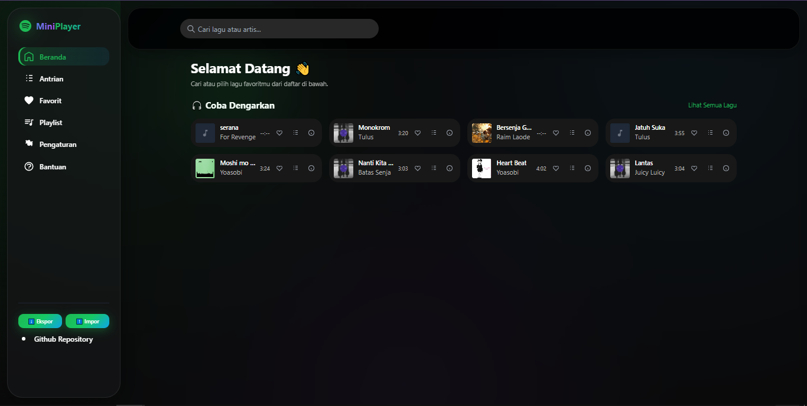

<!-- prettier-ignore -->
# 🚀 MiniPlayer — Frontend

  

Selamat datang di MiniPlayer — frontend ringan untuk pengalaman streaming musik yang cepat, ramah offline, dan mudah dikembangkan.

Daftar isi
- [Fitur utama](#fitur-utama)
- [Demo cepat](#demo-cepat)
- [Quick start](#quick-start)
- [Cara kerja singkat](#cara-kerja-singkat)
- [Tips pemeliharaan](#tips-pemeliharaan)
- [Kontribusi](#kontribusi)
- [Lisensi](#lisensi)

## ✨ Fitur utama
- Now Playing, Search, Library (dikonfigurasi melalui `manifest.json` shortcuts)
- Cache terpisah untuk audio dan assets — memudahkan kontrol ukuran dan pembersihan
- Partial precache: kegagalan fetch satu file tidak menggagalkan instalasi service worker
- Notifikasi update yang ramah pengguna dengan tombol "Segarkan"

## 🎬 Demo cepat
Lihat demo dengan membuka `index.html` di browser modern.



> Tips: coba putar lagu, lalu matikan koneksi untuk melihat pemutaran dari cache.

## ⚡ Quick start
1. Buka folder proyek di editor.
2. Jalankan server statis sederhana, misalnya:

```bash
npx http-server .
# atau: live-server
```

3. Buka `http://localhost:8080` (ganti port sesuai server).
4. Buka DevTools → Application → Service Workers untuk melihat worker aktif.

## 🧠 Cara kerja singkat
- Service worker melakukan precache per-file ke cache statis.
- Audio disimpan di cache terpisah (`miniplayer-audio-v1`) dengan pemangkasan entri tertua.
- Navigasi HTML menggunakan strategi network-first; fallback ke cache saat offline.

## 🛠 Tips pemeliharaan
- Untuk membersihkan cache cepat: unregister Service Worker dan hapus cache lewat DevTools → Clear Storage.
- Tambahkan tombol "Bersihkan Cache" di `settings.html` untuk reset programatik (panggil `caches.keys()` dan `caches.delete()`).

## 🤝 Kontribusi
- Laporkan bug atau minta fitur lewat issue. Pull request diterima — sertakan deskripsi perubahan dan langkah pengujian.

## 📜 Lisensi
- Proyek ini bersifat eksperimental.

---
